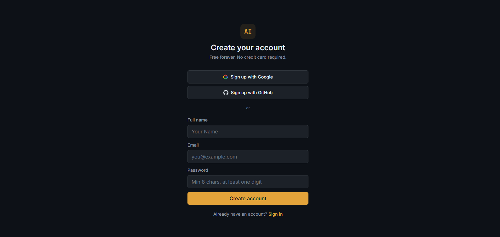
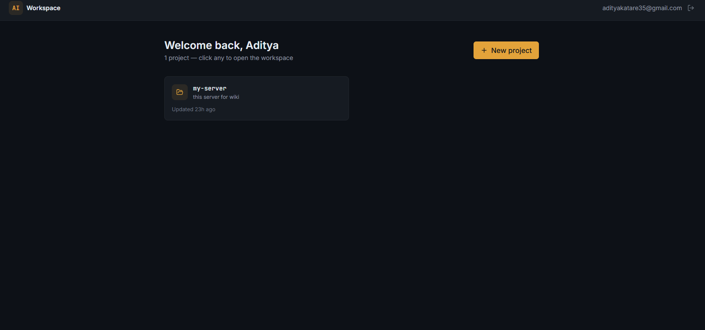
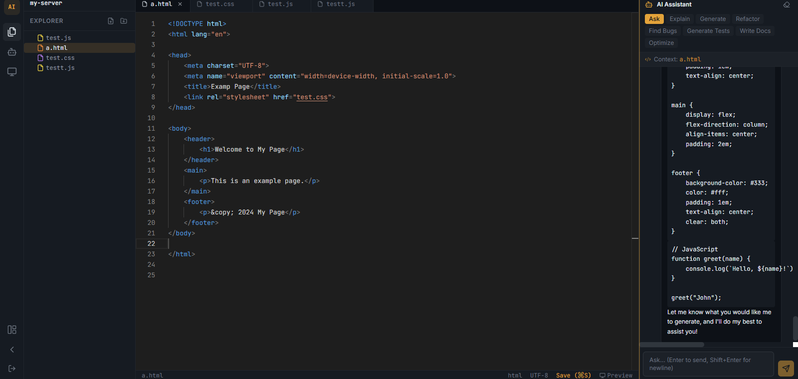
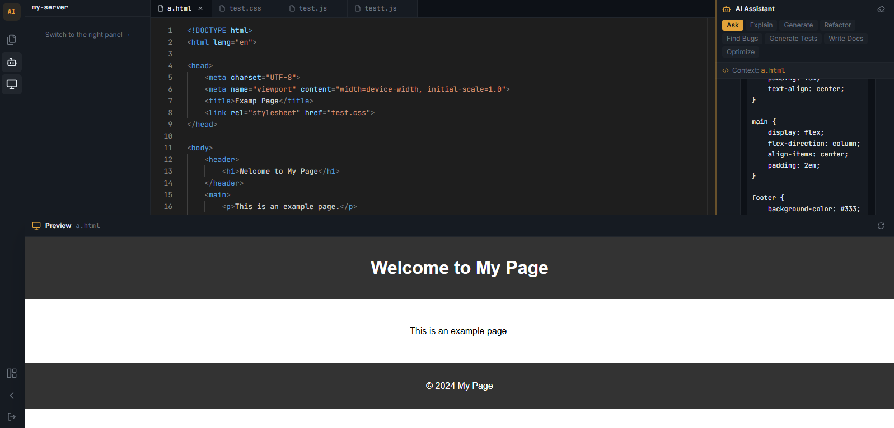

# AI Software Engineer Workspace

A full-stack AI-powered IDE — built to show employers real engineering depth, not just framework familiarity.

**Live demo:** `docker-compose up` and you're running.

---

## What it is

A browser-based workspace where engineers can create projects, write and edit code in a VS Code-quality Monaco editor, navigate a file tree, and ask an AI assistant to explain, refactor, find bugs, generate tests, write docs, and optimize code — with streaming responses from Groq's free API (Llama 3.3 70B).

---


---

---

---


---
## Tech stack

| Layer | Technology | Why |
|---|---|---|
| Frontend | Next.js 14 + TypeScript + Tailwind | App Router, SSR-optional, strong typing |
| State | Zustand | Lightweight, no boilerplate, easy to test |
| Editor | Monaco Editor | The actual VS Code editor in a React component |
| Backend | FastAPI + Python | Async, auto-docs at /docs, fast dev loop |
| Database | PostgreSQL + SQLAlchemy + Alembic | Proper relational schema, type-safe migrations |
| Cache | Redis | Queued for background jobs / rate limiting |
| AI | Groq API (Llama 3.3 70B) | Fast, genuinely free tier, streaming |
| Auth | JWT + OAuth2 (Google + GitHub) | Access + refresh tokens, email verification |
| Infra | Docker Compose | One-command local setup |

---

## Engineering concepts demonstrated

- **Auth from scratch:** JWT access + refresh tokens with auto-rotation, email verification flow, secure forgot-password with short-lived tokens, Google + GitHub OAuth, bcrypt password hashing
- **Streaming API:** Server-Sent Events (SSE) from FastAPI → streamed through the browser fetch API → live text rendering in React, all handled without a third-party streaming library
- **File system in a DB:** Self-referential PostgreSQL table with recursive tree-building for the explorer UI
- **Type safety end-to-end:** Pydantic schemas on the backend, TypeScript interfaces on the frontend, all derived from the same domain model
- **Action-specific AI prompting:** Eight different system prompts for different code-assistance modes, clean separation in a service layer
- **REST API design:** Consistent URL patterns, proper HTTP status codes, bearer auth middleware, CORS config
- **Token refresh queue:** Multiple in-flight 401s get queued and replayed after a single token refresh — the production-correct pattern
- **DB migrations:** Alembic with hand-written initial migration that matches the ORM models exactly

---

## Quick start

### Prerequisites

- Docker + Docker Compose
- A Groq API key (free, no credit card) → [console.groq.com/keys](https://console.groq.com/keys)

### 1. Clone and configure

```bash
git clone <this-repo>
cd ai-swe-workspace

# Backend env
cp backend/.env.example backend/.env
# Edit backend/.env and set GROQ_API_KEY=your_key_here
# (all other defaults work with docker-compose)

# Frontend env
cp frontend/.env.local.example frontend/.env.local
```

### 2. Start everything

```bash
docker-compose up --build
```

This starts Postgres, Redis, the FastAPI backend (with auto-migrations), and the Next.js frontend.

| Service | URL |
|---|---|
| Frontend | http://localhost:3000 |
| Backend API | http://localhost:8000 |
| API docs (Swagger) | http://localhost:8000/docs |

### 3. Use it

1. Go to http://localhost:3000 → Register
2. Check your backend terminal — the email verification link is printed there (dev mode)
3. Create a project, create some files, write code
4. Use the AI panel on the right — pick an action (Explain, Find Bugs, etc.), open a file, send

---

## Running without Docker

```bash
# Backend
cd backend
python -m venv .venv && source .venv/bin/activate  # (Windows: .venv\Scripts\activate)
pip install -r requirements.txt
cp .env.example .env   # edit DATABASE_URL to point at your local Postgres
alembic upgrade head
uvicorn app.main:app --reload

# Frontend (new terminal)
cd frontend
npm install
cp .env.local.example .env.local
npm run dev
```

---

## Optional: Google / GitHub OAuth

1. **Google:** [console.cloud.google.com](https://console.cloud.google.com) → APIs & Services → Credentials → OAuth 2.0 Client ID  
   Add `http://localhost:8000/api/v1/auth/google/callback` as Authorized redirect URI  
   Set `GOOGLE_CLIENT_ID` and `GOOGLE_CLIENT_SECRET` in `backend/.env`

2. **GitHub:** [github.com/settings/developers](https://github.com/settings/developers) → New OAuth App  
   Homepage URL: `http://localhost:3000` · Callback URL: `http://localhost:8000/api/v1/auth/github/callback`  
   Set `GITHUB_CLIENT_ID` and `GITHUB_CLIENT_SECRET` in `backend/.env`

---

## Optional: Real email (instead of console-log)

Set `EMAIL_DEV_MODE=False` in `backend/.env` and configure any free SMTP:

- **Brevo** (formerly Sendinblue) — 300 emails/day free
- **Mailtrap** sandbox — perfect for testing

---

## Roadmap (future phases)

- **Phase 2:** Git integration (connect GitHub repos, view diffs, commit, PRs)
- **Phase 3:** RAG documentation (upload PDFs/API docs, AI answers questions from them)
- **Phase 4:** Team collaboration (invite members, comments, real-time editing via WebSockets)
- **Phase 5:** Deployment (one-click deploy to Render/Railway, build logs, env vars management)
- **Phase 6:** 2FA (TOTP authenticator app support — hooks already in the User model)

---

## Project structure

```
ai-swe-workspace/
├── backend/
│   ├── app/
│   │   ├── api/
│   │   │   ├── deps.py           # Auth dependencies
│   │   │   └── routes/
│   │   │       ├── auth.py       # Register, login, JWT, email verify, password reset
│   │   │       ├── oauth.py      # Google + GitHub OAuth
│   │   │       ├── projects.py   # Project CRUD
│   │   │       ├── files.py      # File/folder CRUD + tree
│   │   │       └── chat.py       # AI streaming endpoint
│   │   ├── core/
│   │   │   ├── config.py         # Settings from env vars
│   │   │   └── security.py       # JWT, bcrypt, token helpers
│   │   ├── db/session.py         # SQLAlchemy engine + session
│   │   ├── models/               # ORM models (User, Project, File, Chat)
│   │   ├── schemas/              # Pydantic I/O schemas
│   │   └── services/
│   │       ├── ai_service.py     # Groq client, prompts, streaming
│   │       └── email_service.py  # Dev-mode + real SMTP
│   ├── alembic/                  # DB migrations
│   ├── requirements.txt
│   └── Dockerfile
├── frontend/
│   └── src/
│       ├── app/                  # Next.js App Router pages
│       ├── components/
│       │   ├── auth/AuthGuard.tsx
│       │   └── workspace/
│       │       ├── FileTree.tsx  # Recursive file explorer
│       │       ├── CodeEditor.tsx # Monaco + tabs + Cmd+S
│       │       └── ChatPanel.tsx  # AI streaming chat UI
│       ├── store/                # Zustand stores (auth, projects, editor)
│       ├── lib/api.ts            # Axios client + JWT refresh queue
│       └── types/index.ts        # Shared TypeScript types
├── docker-compose.yml
└── README.md
```
